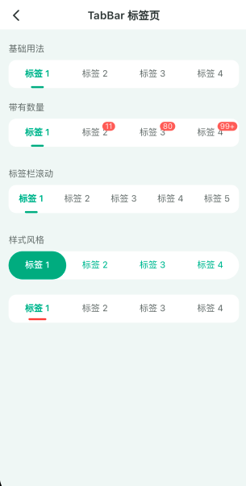

**生活就是面对微笑**

### 文档

[文档链接](https://gitee.com/wubaibin/flutter-face/wikis/pages)

### 平台简介

FlutterFace 是一个功能强大、灵活且易于使用的 Flutter UI 框架，旨在帮助开发者更高效地构建漂亮的用户界面和交互体验。它提供了丰富多样的预制组件，以及各种主题样式，可以满足不同应用程序的设计需求。

### 在线体验
目前只有Android版本，iOS目前没有博主自己的开发者账号

### 部分截图

### 注意事项

1、FlutterFace 是采用 Getx 进行状态管理和路由管理。如果不想使用 Getx,也是可以使用其中的 UI 组件。需要自己将 context 剥离开。

2、目前在 main.dart 中有多语言切换的功能，如果不需要可以删除

3、目前 UI 暂支持 iOS 和 Android

### FlutterFace 功能和特点

预制组件库：FlutterFace 提供了大量的预制组件，包括按钮、输入框、列表、动画、导航栏等等，您可以直接使用这些组件来构建用户界面，省去了从头编写组件的麻烦。

灵活的主题定制：FlutterFace 具有可自定义的主题系统，您可以轻松地更改应用程序的整体外观和样式。通过调整颜色、字体、图标等，您可以快速创建与品牌一致的独特设计。

动画和过渡效果：FlutterFace 提供了丰富的动画和过渡效果，可以为您的应用程序增添生动和流畅的交互体验。通过简单的配置，您可以实现各种动态效果，提高用户对应用的参与感。

文档和示例：FlutterFace 提供了详细的文档和示例代码，使得开发者能够快速上手并理解如何使用框架中的各个组件和功能。这极大地降低了学习成本，并加速了开发进程。

希望 FlutterFace 能为您的 Flutter 开发之旅提供便利和启发！

### 特别鸣谢

[猫哥](https://ducafecat.com) 歪脖子 许半仙及猫哥群里的学员们

[whoitao](https://space.bilibili.com/1601108355)
